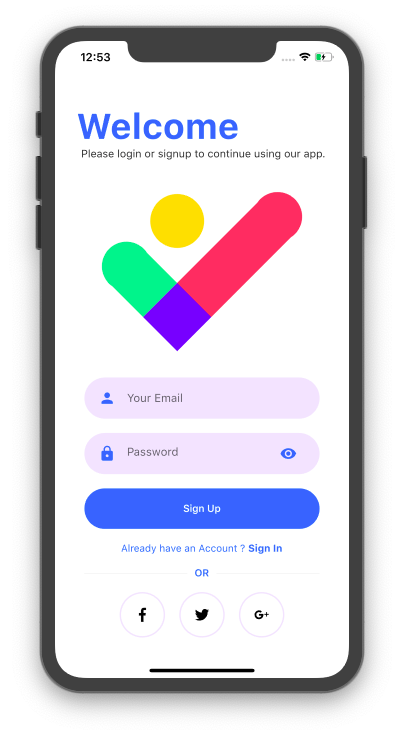
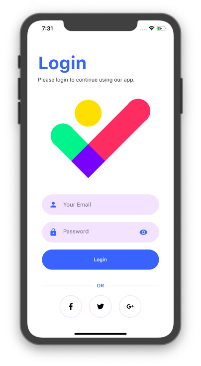

# Healthcare

Tubes project mata kuliah Mobile App - Telkom University

Aplikasi bernama Health Tracker

Kelompok 2C 
Fitur HeartBeat 
Anggota : 
1. Anggara Putra Pratama  (1101174240) 
2. Deny Kurniawan         (1101174126) 
3. Amalia Nur Rahwati     (1101174065) 
4. Rindiani Zainet        (1101174210)  

Kelompok 2E 
Fitur Menghitung Langkah Kaki berdasarkan GoogleMaps 
Anggota : 
1. Muh Nurkhaliz	  (1101174472) 
2. Trheamadiazulsa S(1101174226) 
3. Nandaliyan Rais	() 
4. Andi ALif		() 
5. Rifqy Nurrizqullah	()  

Kelompok 2G 
Weight, Daily, and Food Recommendation 
Anggota : 
1. Amri Khurniawan  (1101198499) 
2. Sri Dewi Sartika Syarifuddin (1101198500) 
3. Bernanda Fredya Putri     (1101198519) 
4. Fira Mutia Ramaida       (1101198536)  

  

## Getting Started

This project is a starting point for a Flutter application.

A few resources to get you started if this is your first Flutter project:

- [Lab: Write your first Flutter app](https://flutter.dev/docs/get-started/codelab)
- [Cookbook: Useful Flutter samples](https://flutter.dev/docs/cookbook)

For help getting started with Flutter, view our
[online documentation](https://flutter.dev/docs), which offers tutorials,
samples, guidance on mobile development, and a full API reference.
